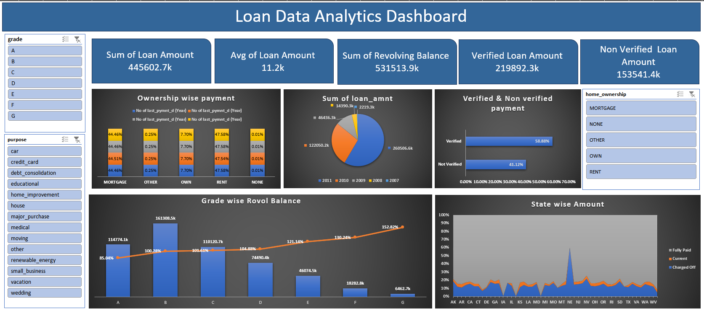
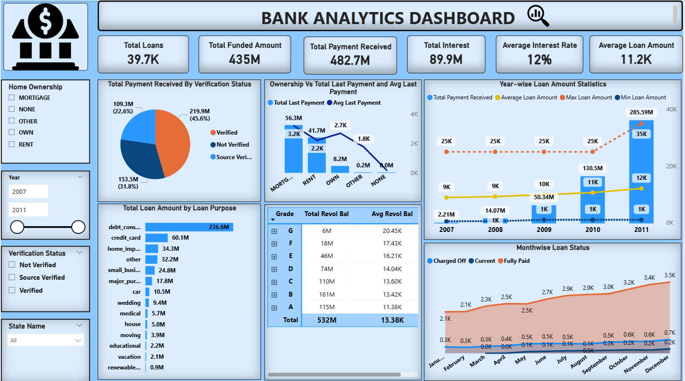
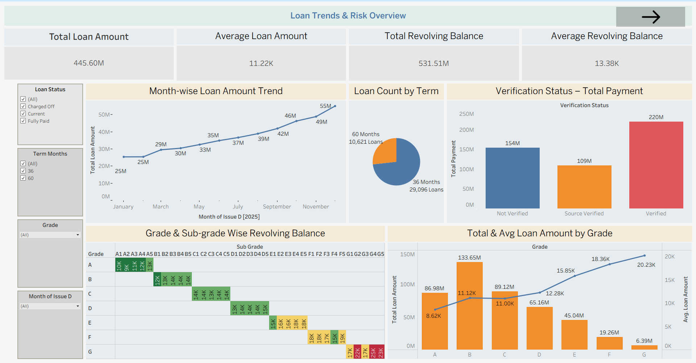
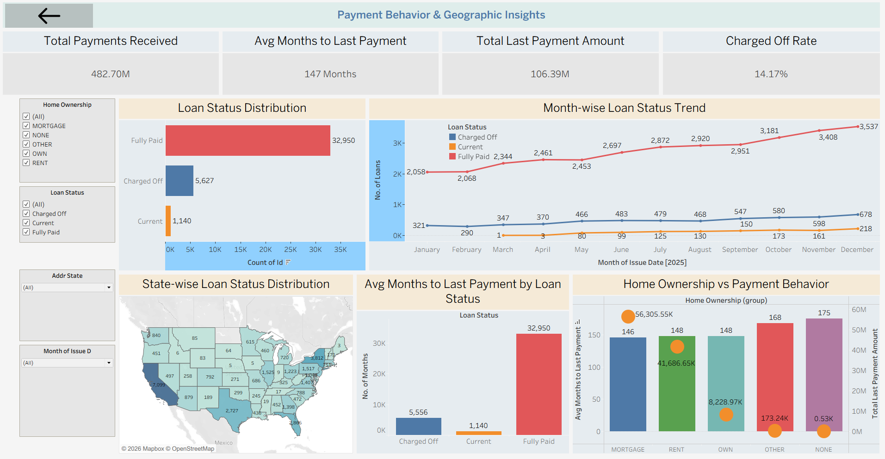

# Bank-Loan-Analytics (Excel | Power BI | Tableau)

## Project Overview
This project presents an end-to-end **bank loan analytics solution** built using **Excel, Power BI, and Tableau**.  
The objective is to convert raw loan transaction data into **interactive dashboards** that help banks analyze loan performance, borrower behavior, and risk indicators.

---

## Problem Statement
The bank maintained loan data in large Excel files without meaningful visualization, resulting in:
- Manual and time-consuming analysis
- Difficulty identifying loan trends and risk patterns
- Limited visibility into borrower repayment behavior
- No interactive reporting for decision-makers

A centralized and interactive analytics solution was required.

---

## Solution
- Cleaned and preprocessed large loan datasets (39k+ records per file)
- Designed KPIs aligned with banking and credit-risk analysis
- Built dashboards using Excel, Power BI, and Tableau to compare insights across BI tools
- Enabled trend, geographic, and borrower-level analysis

---

## Dashboards

### Excel Dashboard
- Pivot tables and pivot charts
- KPI summary cards for loan and payment metrics
- Conditional formatting for trend and risk indicators
- Slicers for dynamic filtering

**Screenshot:**  

📁 `Excel_Dashboard/`

---

### Power BI Dashboard
- Data modeling with relationships
- DAX-based KPI calculations
- Interactive slicers and drill-down analysis
- State-wise and time-based loan insights

**Screenshot:**  

📁 `PowerBI_Dashboard/`

---

### Tableau Dashboard
- Interactive visual analytics
- Filters and parameters for exploration
- Geographic and trend-based storytelling
- Executive-level dashboard layout

**Screenshots:**

**Dashboard 1 – Loan Overview**

**Dashboard 2 – Risk & Repayment Analysis**

📁 `Tableau_Dashboard/`

---

## Key KPIs
- Total loan amount disbursed
- Average loan amount per year
- Grade & sub-grade wise revolving balance
- Total payment: Verified vs Non-Verified borrowers
- Loan status distribution by state and month
- Home ownership vs repayment behavior

---

## Tools & Technologies
- **Excel** – Pivot Tables, Charts, Conditional Formatting  
- **Power BI** – Data Modeling, DAX, Interactive Reports  
- **Tableau** – Visual Analytics, Dashboards  
- **SQL** – Aggregation and analytical queries  

---

## How to Run
1. Clone the repository  
2. Open the respective dashboard file (Excel / Power BI / Tableau)  
3. Use slicers, filters, and drill-downs to explore insights  

---

## Key Takeaways
- Transformed raw banking data into decision-ready dashboards
- Identified trends in loan disbursement and repayment behavior
- Improved visibility into borrower risk and geographic patterns
- Demonstrated strong BI and analytics skills across multiple tools

---

## Author
**Sai Pranav Banaganapalli**  
B.Tech – Computer Science & Engineering  
Data Analytics | Power BI | Tableau | SQL